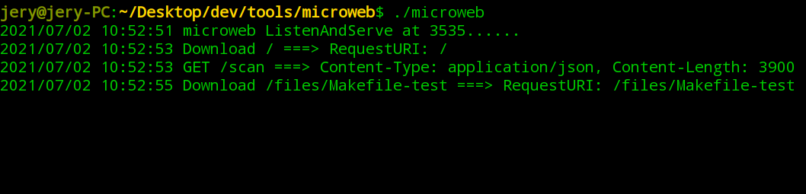

# microweb
microweb is a minimalist web static server, single-file cross-platform, supports resource file previews such as text files, pictures, audio and video, and pdf documents, and supports control scripts to execute shell commands for file downloads or directory access

microweb是一个极简web静态服务器, 单文件跨平台, 支持文本文件,图片, 音视频，以及pdf文档等资源文件预览，支持控制脚本针对文件下载或目录访问执行shell指令




# Installation

linux: wget https://download.refitself.cn/files/microweb/microweb_linux_amd64

windows: wget https://download.refitself.cn/files/microweb/microweb_windows_amd64.exe

darwin: wget https://download.refitself.cn/files/microweb/microweb_darwin_amd64

# go get Installation (Development)
```go
go get github.com/refitor/microweb
```

# Usage
```go
microweb [--script=control.sh]
```

# Options
```go
--script=./control.sh, execute demo: ./control.sh /files abc.txt
```

# Development
```go
// Install tools
go get github.com/GeertJohan/go.rice

// Build
go get github.com/refitor/microweb
cd ./microweb && go generate

// Run
./microweb

```
